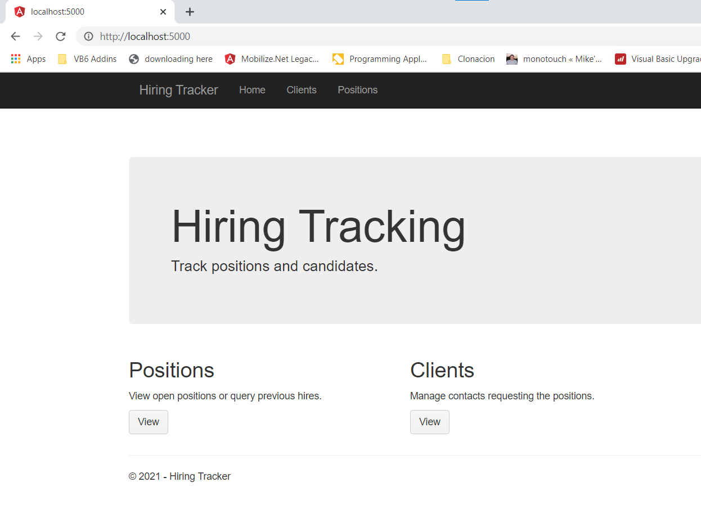
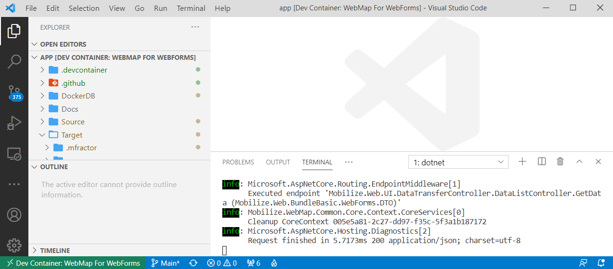
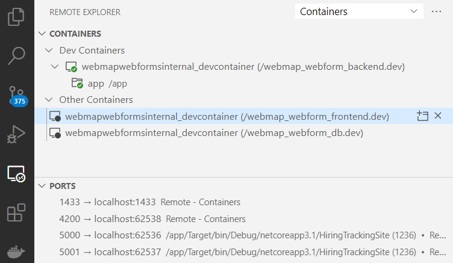
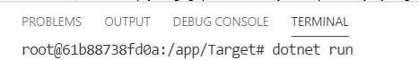

# WebMap for WebForms Demo 

This repository contains an small demo of a ASP.NET WebForms application that has been 
upgraded to a ASP.NET Core Backend + Angular FrontEnd.



If you want more technical documentation about our webmap product:
- [General Product Information](https://www.mobilize.net/products/app-migrations/webmap/)
- [Documentation for WebMap](https://docs.mobilize.net/webmap/)
 - [Sample Reference App for VB6 and Winforms](https://github.com/MobilizeNet/SKS)

## Repository Contents

- Source
    - this folder contains the original source code for an ASP.NET WebForms app
- Target
    - this folder contains the target source code after in ASP.NET Core + Angular

## How to build

### Building locally

If you want to build this project on your development machine, just check that you match this requirements:

* [Node.js LTS](https://nodejs.org/en/download/)
* [Visual Studio 2019](https://visualstudio.microsoft.com/downloads/)
* [.NET Core](https://dotnet.microsoft.com/download)

> NOTE: Your installation of Visual Studio, must include the *ASP.NET and Web Development Feature *
>
> To install this feature open your VS installer and Go to Workloads tab and then turn on ASP.Net and web development as in the following picture: 


To build your application just open the `Target/HiringTrackingSite.sln` file with VS Studio and select **Rebuild**. This will install any missing dependencies and trigger the build process.

> NOTE: the angular frontend is already built. If you want to build it yourself see the step on Building the Frontend code.


## Building the FrontEnd code

To build the frontend code make sure you already have [Node.js LTS](https://nodejs.org/en/download/) installed.

Open a terminal at `Target/hiringtrackingsite-angular` and run:
```
npm install
npm run build
```

## [Developing inside a Container](https://code.visualstudio.com/docs/remote/containers)

Working with Containers is everyday more common. 
VS Code provides amazing support for working with containers. In this repository we provide a `.devcontainer` folder with a `docker-compose.yml` setup to run this app.

The compose will start:
* a container for working with your backend code.
* a container for starting your angular frontend in development mode so you can try your changes right away.
* a container for the SQL Database so you dont have to worry on how to set it up.

In you have the [Remote Containers extensions](https://marketplace.visualstudio.com/items?itemName=ms-vscode-remote.remote-containers) vscode will recognize it and ask you to open your solution using this configuration.



If everything works you should see your 3 containers:



To start playing with your app open a terminal and start your backend:




